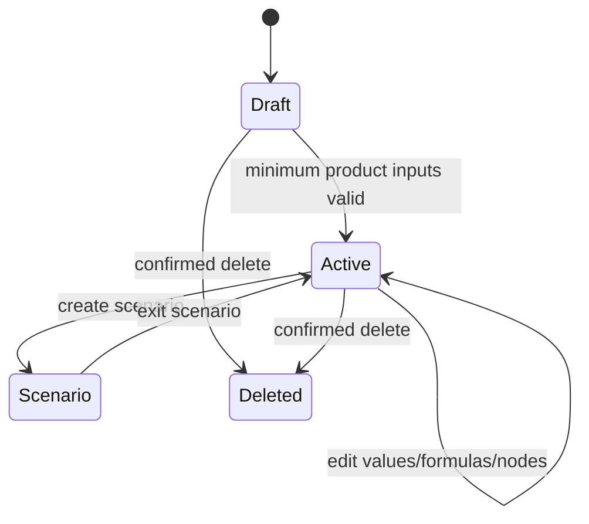
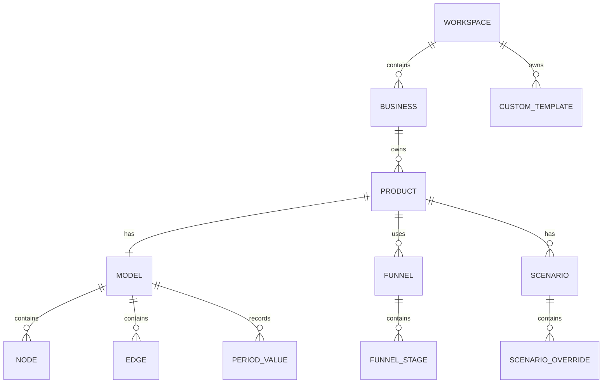
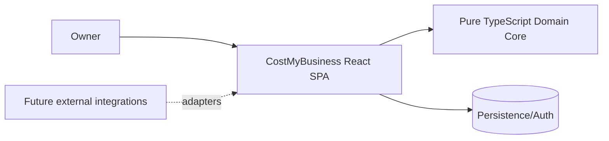

# Product Requirements Document: CostMyBusiness

<!-- prd-section:document-control -->
## 0. Document control

| Field | Value |
|---|---|
| Status | Draft |
| Implementation readiness | READY WITH ASSUMPTIONS |
| Version | 0.1 |
| Last updated | 2026-09-22 |
| Product owner | User / repository owner |
| Technical owner | [UNKNOWN] |
| Target release | [UNKNOWN] |
| Evidence cutoff | Conversation through 2026-09-22 |

### Change history

| Version | Date | Change | Source / decision |
|---|---|---|---|
| 0.1 | 2026-09-22 | Initial implementation-ready product specification derived from product discovery conversation | S-001..S-007 |

<!-- prd-section:source-ledger -->
## 1. Evidence and source ledger

| Source ID | Source | Evidence summary | Reliability | Affected sections |
|---|---|---|---|---|
| S-001 | User conversation: generic cost tool concept | Product should model product price, department/layer costs, nested cost positions, and cost flow as nodes for use across industries | Direct | Goals, scope, FR-001..FR-008 |
| S-002 | User conversation: marketing funnel profitability | User must be able to compare how much remains after each marketing funnel and enter budget, CTR, conversion cost and related funnel metrics; CAC should be calculated | Direct | Funnels, metrics, scenarios, FR-009..FR-016 |
| S-003 | User conversation: guidance and templates | Every business term such as LTV or CTR needs an explanatory tooltip with example; users need product and industry templates; industry presets prepopulate removable cost positions | Direct | Glossary, templates, UX, FR-017..FR-022 |
| S-004 | User conversation: V1 decisions | Personal-first use, automatic graph connections, editable default formulas, day/week/month/quarter/year period switching with month default, Actual/Budget/Scenario from day one | Direct | Data model, formula engine, scenarios, FR-023..FR-030 |
| S-005 | User conversation: technology | TypeScript and React are desired | Direct | Architecture, stack |
| S-006 | User conversation: architecture discussion | Vertical-slice modular monolith with a shared domain core is the preferred architecture direction over a classic whole-app onion layout | Direct / accepted recommendation | Architecture, delivery |
| S-007 | User conversation: product identity | Product name is CostMyBusiness | Direct | Document-wide |

### Conflicts

No unresolved source conflicts were identified.

<!-- prd-section:summary -->
## 2. Executive summary

### Context

CostMyBusiness is a personal-first business profitability modeling application. It helps a user understand how revenue from a product or service is reduced by acquisition, sales, delivery/operations, support, product/technology, and shared overhead costs. The model must work across industries instead of encoding one fixed business model.

### Problem

Existing spreadsheets can calculate costs but make it difficult to see the causal path from a product price through acquisition funnels, operational cost drivers, allocations, and final contribution/profit. They also require the user to know which cost positions belong where, which formulas to use, and how to avoid mixing direct costs with allocated overhead.

### Proposed solution

CostMyBusiness presents an automatically generated, configurable cost graph. The user creates a business and product, optionally selects an industry/product template, enters values, and receives live calculations for unit economics and total-period results. Marketing and sales may contain funnels. Cost positions are driver-based. Default formulas are editable through a safe formula language. Users can switch periods and compare Actual, Budget, and Scenario states. Contextual explanations and examples are available for financial and marketing terms throughout the UI.

### Value proposition

The application should answer, with traceable calculations:

- What does one unit/customer/order really earn?
- Which acquisition funnel produces the most profitable customers?
- Which cost layer is consuming margin?
- What changes if a conversion rate, price, staffing cost, operational productivity, or other driver changes?
- What is the maximum sustainable CAC or break-even volume?
- Is it more valuable to scale demand or optimize operations?

### Desired outcomes

| Goal ID | Outcome | Baseline | Target | Measurement window | Status / source |
|---|---|---|---|---|---|
| G-001 | A user can build a complete profitability model without starting from a blank spreadsheet | Manual spreadsheet/modeling | Complete guided model from template or custom setup | Per model creation | [CONFIRMED] S-001, S-003 |
| G-002 | A user can compare profitability by acquisition funnel | Manual / fragmented analysis | Per-funnel contribution and CAC visible from one product model | Per analysis session | [CONFIRMED] S-002 |
| G-003 | A user can identify why costs change, not only the final result | Mixed cost totals | Drill-down from layer to cost driver and formula | Per analysis session | [CONFIRMED] S-001 |
| G-004 | A user can test business changes before acting | Manual duplicate spreadsheets | Actual/Budget/Scenario comparisons with live recalculation | Per scenario session | [CONFIRMED] S-004 |
| G-005 | Non-finance users can understand terminology in context | External lookup required | Glossary-backed tooltip with definition, formula, and example | Per relevant UI surface | [CONFIRMED] S-003 |

### Non-goals

- CostMyBusiness V1 is not accounting software, bookkeeping software, payroll software, a tax calculator, or a system of record for invoices.
- V1 does not execute payments or move money.
- V1 does not replace ERP, CRM, HR, ad platforms, or DATEV.
- V1 does not provide collaborative multi-user editing or company roles/permissions.
- V1 does not require third-party data integrations; imports/sync are later scope.
- V1 is not a free-form n8n-style workflow builder. The graph is generated from business concepts and primarily configured rather than manually wired.

<!-- prd-section:constitution -->
## 3. Product constitution and constraints

### Durable principles

1. **Explain the number.** Every result must be traceable to inputs, formulas, allocations, and drivers.
2. **Configuration over hard-coded industries.** Industry behavior is represented by templates and metadata, not industry-specific application branches.
3. **Automatic structure, user control.** CostMyBusiness should generate sensible graphs and defaults while allowing optional positions to be removed, renamed, disabled, or replaced.
4. **Direct and allocated costs remain distinguishable.** The system must not make overhead look like an incremental per-order cost.
5. **Fast local feedback.** Editing an input should update dependent calculations without a normal server round trip.
6. **Safe formulas.** User formulas are data expressions, never executable JavaScript.
7. **One business truth, multiple views.** The same domain model powers graph, tables, charts, inspector, scenarios, and reports.
8. **Personal-first, company-capable.** V1 optimizes for one user while preserving ownership boundaries that can later support company workspaces.

### Hard constraints

- TypeScript and React are confirmed technology constraints. [CONFIRMED] S-005
- Default period is Month; supported display periods are Day, Week, Month, Quarter, Year. [CONFIRMED] S-004
- Actual, Budget, and Scenario are first-class V1 concepts. [CONFIRMED] S-004
- Default formulas are editable by the user. [CONFIRMED] S-004
- Industry/product templates can prepopulate nodes but every optional generated position can be removed. [CONFIRMED] S-003
- Graph connections are predominantly generated automatically. [CONFIRMED] S-004

### Dependencies

- A browser runtime capable of modern React applications.
- Persistent storage for user models and custom templates.
- A deterministic formula parser/evaluator.
- A node-graph visualization library; current architecture recommendation is React Flow with automatic layout. [PROPOSED]

### Glossary

| Term | Definition | Source |
|---|---|---|
| Cost driver | Measurable activity that causes a cost, e.g. order, hour, km, stop, transaction, user, API call | S-001 |
| Direct cost | Cost directly attributable to a product, order, customer, or transaction | S-001 |
| Allocated cost | Shared cost distributed to a product using an explicit allocation rule | S-001 |
| Contribution | Revenue remaining after a configured set of attributable costs | S-001 |
| CAC | Customer Acquisition Cost; acquisition cost divided by acquired customers under a defined scope | S-002 |
| Funnel | Ordered stages through which volume converts, e.g. impressions to clicks to orders | S-002 |
| Actual | Observed/current values for a period | S-004 |
| Budget | Planned baseline values for a period | S-004 |
| Scenario | Derived model that overrides selected values to test a hypothetical | S-004 |

<!-- prd-section:users -->
## 4. Users, actors, and stakeholders

| Actor / role | Job to be done | Need / pain | Access boundary | Success signal | Source |
|---|---|---|---|---|---|
| Primary owner | Model a business/product and decide where to optimize or scale | Needs one understandable, reusable model instead of spreadsheet sprawl | Owns all V1 data in personal workspace | Can build, inspect, compare, and modify a model independently | S-001..S-004 |
| Future company member | Collaborate on shared company models | Not V1 | Future company workspace boundary | Later release | S-004 |
| System template maintainer | Define shipped glossary and industry/product defaults | Needs versioned defaults without changing calculation engine | Repository-level product configuration | Templates update without special-case calculation code | [INFERRED] from S-003 |

### Accessibility and inclusion needs

- Keyboard-only operation must be possible for all essential actions.
- Financial meaning must not rely on color alone.
- Tooltips must also be reachable by focus/tap, not hover only.
- Graph content must have a non-canvas/list representation for small screens and assistive technology.
- Target: WCAG 2.2 AA. [PROPOSED]

### Stakeholder responsibilities

- Product owner approves product behavior, formulas, template content, and glossary wording.
- Technical owner is [UNKNOWN].
- No finance/legal sign-off is implied by the application output; the product should communicate that it is a modeling tool, not accounting advice.

<!-- prd-section:scope -->
## 5. Scope and release boundary

### MVP / current release

- Personal workspace.
- Multiple businesses and products.
- Product creation from industry/product templates or custom blank model.
- Automatic cost graph generation.
- Revenue, acquisition, marketing, sales, operations/delivery, support, product/technology, and overhead grouping where applicable.
- Add, edit, disable, remove, duplicate, and rename configurable cost positions.
- Driver-based costs and allocations.
- Marketing/sales funnel stages and derived funnel metrics.
- Safe editable formulas with defaults and reset-to-default.
- Actual, Budget, and Scenario values.
- Day, Week, Month, Quarter, Year display switching; Month default.
- Per-unit and total-period results.
- Funnel-attributed profitability.
- Contextual glossary tooltips with definitions, formulas, and examples.
- Default industry templates including at minimum SaaS, E-commerce, Service, Traffic Safety, and Custom.
- Custom saved templates.
- Scenario comparison and basic sensitivity editing.
- Persistent storage and authenticated owner access. [PROPOSED]

### Later releases

- Google Ads, Meta, Stripe/payment, CRM, ERP, HR, DATEV, and bank integrations.
- Automated Actual ingestion and reconciliation.
- Multi-user company workspaces and permissions.
- Comments/collaboration.
- Template marketplace/sharing.
- AI-assisted model suggestions and anomaly explanations.
- Forecasting and advanced sensitivity matrices.

### Explicitly out of scope

- General-purpose workflow automation.
- Arbitrary executable user code.
- Real-time collaborative graph editing.
- Accounting ledger, tax filing, payroll, invoicing, payments.
- Native mobile application for V1.

### Scope assumptions

The active assumptions are maintained once in section 20 (`A-001` through `A-004`) to avoid duplicate definitions.

<!-- prd-section:journeys -->
## 6. User journeys and process flows

### Journey J-001: Create first profitability model

| Step | Actor | Trigger / action | Touchpoint | System state and data | Failure / recovery | Analytics |
|---|---|---|---|---|---|---|
| 1 | Owner | Creates business | Businesses | Business draft created | Validation remains inline; no partial ghost record | business_created |
| 2 | Owner | Creates product | Product wizard | Product name, currency, price, volume context | User can leave and resume draft | product_created |
| 3 | Owner | Selects industry/product template | Template step | Template copied into product model | User can choose Custom or remove generated positions | template_applied |
| 4 | Owner | Reviews suggested layers/costs | Review step | Optional nodes selected/removed | Reset to template defaults available | template_reviewed |
| 5 | Owner | Enters initial values | Product model | Inputs saved; calculations run locally | Invalid fields block dependent result and explain why | model_value_changed |
| 6 | Owner | Opens graph | Model screen | Graph, KPIs, inspector available | Empty/invalid nodes called out | model_opened |

### Journey J-002: Compare marketing funnels

1. Owner opens a product with two or more acquisition funnels.
2. Owner selects a funnel filter such as Google Search or SEO.
3. CostMyBusiness scopes acquisition metrics to that funnel while retaining shared delivery/overhead rules according to configured allocation.
4. The UI displays media CPA, fully loaded marketing CAC, total acquisition CAC where applicable, contribution per unit, contribution margin, and period contribution.
5. Owner switches to another funnel or compare mode.

### Journey J-003: Create a what-if scenario

1. Owner starts from Actual or Budget.
2. Owner creates a named Scenario.
3. Scenario stores only overrides, not a full duplicate model.
4. Owner changes a driver such as CVR, price, stops/hour, hourly cost, or churn.
5. Calculation engine propagates changes through dependent nodes.
6. Comparison view shows delta for revenue, CAC, delivery cost, contribution, margin, and fully loaded profit where available.
7. Owner can reset an override to inherit its base value again.

### Journey J-004: Understand a business term

1. Owner encounters a supported term such as CTR, LTV, CAC, COGS, or contribution margin.
2. Owner hovers, focuses, or taps the info affordance.
3. Tooltip/popover displays full name, plain-language definition, formula when applicable, and concrete numeric example.
4. User may open the full Glossary entry without losing model context.

### Alternate, admin, support, and destructive flows

- Deleting a business/product/model/template requires explicit confirmation and communicates scope of deletion.
- Removing a generated cost node removes it only from the current product unless the user explicitly edits/saves a custom template.
- Resetting a custom formula restores the product/template default and does not alter historical Actual values.
- If a scenario references a node later removed from the base model, the scenario override is flagged as orphaned and excluded until resolved.

### State model



<!-- prd-section:functional-requirements -->
## 7. Functional requirements

| ID | Requirement | Priority | Status | Rationale | Sources | Acceptance | Dependencies |
|---|---|---|---|---|---|---|---|
| FR-001 | The system shall allow the owner to create multiple businesses and products. | Must | [CONFIRMED] | Generic reuse | S-001, S-004 | SCN-001 | A-001 |
| FR-002 | The system shall represent a product model as revenue plus configurable cost/result nodes grouped into business layers. | Must | [CONFIRMED] | Core product model | S-001 | SCN-002 | - |
| FR-003 | The system shall automatically create the normal dependency structure between generated nodes. | Must | [CONFIRMED] | Reduce setup/error burden | S-004 | SCN-002 | FR-002 |
| FR-004 | The owner shall be able to add, rename, disable, duplicate, and remove optional generated cost positions. | Must | [CONFIRMED] | Templates remain editable | S-003 | SCN-003 | FR-002 |
| FR-005 | Each cost shall support an explicit cost behavior and driver such as per unit, order, customer, employee, hour, km, stop, transaction, click, API call, percentage revenue, fixed period, or custom formula. | Must | [CONFIRMED] | Industry independence | S-001 | SCN-004 | FR-002 |
| FR-006 | The system shall keep direct costs and allocated/shared costs distinguishable in calculations and UI. | Must | [INFERRED] | Avoid false marginal-cost interpretation | S-001 | SCN-005 | FR-005 |
| FR-007 | The system shall calculate per-unit and total-period results from the same model. | Must | [CONFIRMED] | Unit economics plus planning | S-001 | SCN-006 | FR-005 |
| FR-008 | The system shall provide drill-down from top-level result to department/layer, cost node, driver, input, and formula. | Must | [CONFIRMED] | Explainability | S-001 | SCN-007 | FR-002 |
| FR-009 | The system shall support marketing funnels with ordered stages and stage conversion rates. | Must | [CONFIRMED] | Acquisition modeling | S-002 | SCN-008 | - |
| FR-010 | Marketing funnels shall support media spend plus operating costs such as personnel, agency, and tools. | Must | [CONFIRMED] | Fully loaded acquisition cost | S-002 | SCN-008 | FR-009 |
| FR-011 | The system shall derive applicable funnel metrics including clicks, conversions, CPC, CPA and CAC when required inputs exist. | Must | [CONFIRMED] | Funnel analysis | S-002 | SCN-009 | FR-009 |
| FR-012 | The system shall support sales funnels with configurable stages and costs. | Should | [INFERRED] | Generic B2B modeling | S-001, S-002 | SCN-010 | FR-009 |
| FR-013 | The owner shall be able to filter product profitability by acquisition funnel. | Must | [CONFIRMED] | Compare channel profitability | S-002 | SCN-011 | FR-009 |
| FR-014 | The system shall calculate media-only acquisition cost separately from fully loaded acquisition cost when both are defined. | Must | [INFERRED] | Distinguish spend from channel operations | S-002 | SCN-009 | FR-010 |
| FR-015 | The system shall support break-even and maximum-sustainable-cost calculations when the required variables are available. | Should | [INFERRED] | Decision support | S-001, S-002 | SCN-012 | FR-007 |
| FR-016 | The system shall propagate a changed input to all dependent calculated results deterministically. | Must | [CONFIRMED] | What-if analysis | S-002, S-004 | SCN-013 | FR-023 |
| FR-017 | The UI shall provide contextual glossary help for supported domain terms. | Must | [CONFIRMED] | Learnability | S-003 | SCN-014 | - |
| FR-018 | Each glossary term shall support a short definition, full name where applicable, formula where applicable, numeric example, category, and related terms. | Must | [CONFIRMED] | Consistent explanation | S-003 | SCN-014 | FR-017 |
| FR-019 | The system shall ship industry templates that preconfigure common layers, costs, drivers, formulas, metrics, and guidance. | Must | [CONFIRMED] | Faster onboarding | S-003 | SCN-015 | FR-002 |
| FR-020 | Traffic Safety shall be available as an industry template and may prepopulate operations positions such as drivers, vehicles, traffic equipment, permits/authority fees, storage, setup/removal, and subcontractors. | Must | [CONFIRMED] | Concrete requested industry | S-003 | SCN-015 | FR-019 |
| FR-021 | The owner shall be able to save a customized product model as a reusable custom template. | Must | [CONFIRMED] | Reuse | S-003 | SCN-016 | FR-019 |
| FR-022 | Every layer/department shall provide contextual guidance describing what normally belongs there, specialized by selected industry when available. | Must | [CONFIRMED] | Guided modeling | S-003 | SCN-017 | FR-019 |
| FR-023 | Default metric and node formulas shall be visible and editable by the owner. | Must | [CONFIRMED] | User control | S-004 | SCN-018 | - |
| FR-024 | Custom formulas shall be parsed and evaluated through a restricted expression language and shall not execute JavaScript or arbitrary code. | Must | [PROPOSED] | Security and determinism | S-004 | SCN-019 | FR-023 |
| FR-025 | The owner shall be able to reset a custom formula to its inherited/default formula. | Must | [INFERRED] | Safe experimentation | S-004 | SCN-018 | FR-023 |
| FR-026 | The system shall support Actual, Budget, and Scenario as first-class model contexts. | Must | [CONFIRMED] | Planning | S-004 | SCN-020 | - |
| FR-027 | A Scenario shall inherit from a base context and store only changed overrides where feasible. | Must | [PROPOSED] | Prevent model duplication/drift | S-004 | SCN-021 | FR-026 |
| FR-028 | The owner shall be able to compare multiple contexts/scenarios side by side. | Must | [CONFIRMED] | Decision support | S-004 | SCN-022 | FR-026 |
| FR-029 | The UI shall support Day, Week, Month, Quarter, and Year views with Month selected by default. | Must | [CONFIRMED] | Requested period flexibility | S-004 | SCN-023 | - |
| FR-030 | Costs and quantities shall retain their native basis/period so period switching uses normalization rules rather than naive display division. | Must | [INFERRED] | Calculation correctness | S-004 | SCN-023 | FR-029 |
| FR-031 | The system shall persist owner data and custom templates between sessions. | Must | [INFERRED] | Usable personal tool | S-003, S-004 | SCN-024 | A-001 |
| FR-032 | The graph view shall use the domain graph as source data and shall not make visualization-library node objects the system of record. | Must | [PROPOSED] | Replaceable UI dependency | S-006 | SCN-025 | - |

### Business rules and invariants

| Rule ID | Rule | Scope | Failure behavior | Source |
|---|---|---|---|---|
| BR-001 | A model graph must be acyclic for calculation dependencies. | Calculation graph | Reject/flag connection or formula dependency that creates a cycle | [PROPOSED] |
| BR-002 | Division by zero or missing required inputs must produce an explicit unresolved result, never Infinity/NaN in user UI. | Formula engine | Show actionable validation state | [PROPOSED] |
| BR-003 | Money calculations must use explicit currency and deterministic rounding rules. | Finance calculations | Block ambiguous mixed-currency aggregation | [PROPOSED] |
| BR-004 | Removing a template-generated node changes the product instance only unless custom template save/edit is explicitly invoked. | Templates | No mutation of shipped template | S-003 |
| BR-005 | A scenario override takes precedence over its base value; removal of the override restores inheritance. | Scenarios | Orphan overrides are flagged and excluded | [PROPOSED] |
| BR-006 | Direct and allocated totals must remain separately inspectable even when a fully loaded result combines them. | Results | UI cannot collapse provenance irreversibly | [INFERRED] |

<!-- prd-section:scenarios -->
## 8. Acceptance scenarios

### SCN-001: Create businesses and products
- Covers: `FR-001`
- Given: an authenticated owner
- When: the owner creates two businesses and multiple products
- Then: each product remains scoped to its selected business
- And: opening one business does not expose products from another unless navigated explicitly.

### SCN-002: Generate a product cost graph
- Covers: `FR-002`, `FR-003`
- Given: a new product with a selected template
- When: the template is applied
- Then: the graph contains the template's relevant revenue/layer/cost/result structure
- And: dependencies are connected without requiring manual wiring.

### SCN-003: Remove optional generated positions
- Covers: `FR-004`
- Given: a template-generated Operations group with optional Driver and Vehicle nodes
- When: the owner removes Vehicle
- Then: Vehicle no longer contributes to the product calculation
- And: the underlying shipped template remains unchanged.

### SCN-004: Driver-based cost calculation
- Covers: `FR-005`
- Given: a Driver cost node configured as hourly rate multiplied by hours per order
- When: either input changes
- Then: per-order and period costs recalculate using that driver.

### SCN-005: Separate direct and allocated costs
- Covers: `FR-006`
- Given: direct delivery costs and an HR overhead allocation
- When: the result is displayed
- Then: direct contribution and allocated overhead are separately visible
- And: fully loaded profit may combine them only with drill-down provenance.

### SCN-006: Unit and period totals
- Covers: `FR-007`
- Given: a valid product price, unit volume and costs
- When: the owner switches between unit and period summary
- Then: both views are consistent with the same underlying model.

### SCN-007: Drill into a result
- Covers: `FR-008`
- Given: a calculated contribution result
- When: the owner opens its drill-down
- Then: the UI shows contributing layers, nodes, drivers, inputs, formulas and allocated/direct status.

### SCN-008: Configure marketing funnel
- Covers: `FR-009`, `FR-010`
- Given: a Google Ads funnel
- When: the owner enters spend, impressions/CTR or clicks, conversion rate, agency cost, personnel cost and tool cost
- Then: the funnel stores both stage and operating-cost data.

### SCN-009: Calculate acquisition metrics
- Covers: `FR-011`, `FR-014`
- Given: enough valid inputs for a marketing funnel
- When: calculations run
- Then: applicable derived metrics are shown
- And: media-only CPA/CAC is distinguishable from fully loaded marketing CAC.

### SCN-010: Model sales funnel
- Covers: `FR-012`
- Given: a product using sales-assisted acquisition
- When: the owner adds lead, qualified, proposal and won stages plus sales costs
- Then: sales stage conversions and sales acquisition cost are calculated from configured inputs.

### SCN-011: Filter profitability by funnel
- Covers: `FR-013`
- Given: one product has Google Generic and SEO funnels
- When: the owner selects Google Generic
- Then: revenue attribution and acquisition cost use that funnel context
- And: shared downstream costs use the configured allocation rules.

### SCN-012: Break-even calculation
- Covers: `FR-015`
- Given: fixed cost, contribution per unit and required target inputs are valid
- When: the owner opens break-even
- Then: the calculated break-even volume or maximum allowable acquisition cost states its formula and inputs.

### SCN-013: Live dependency propagation
- Covers: `FR-016`
- Given: a valid model
- When: CVR changes from one valid value to another
- Then: all dependent funnel, CAC, revenue and profit metrics update in the same interaction cycle without a normal persistence round trip.

### SCN-014: Understand a glossary term
- Covers: `FR-017`, `FR-018`
- Given: CTR is displayed
- When: the owner hovers, focuses or taps its info affordance
- Then: full name, definition, formula and numeric example are available
- And: the content is keyboard accessible.

### SCN-015: Apply Traffic Safety template
- Covers: `FR-019`, `FR-020`
- Given: the owner creates a product and selects Traffic Safety
- When: template configuration is shown
- Then: relevant suggested Operations positions are preselected
- And: the owner can remove any optional suggestion before or after creation.

### SCN-016: Save custom template
- Covers: `FR-021`
- Given: the owner has customized a product model
- When: Save as template is confirmed
- Then: a reusable owner-scoped template is created without changing the original shipped template.

### SCN-017: Layer guidance
- Covers: `FR-022`
- Given: Traffic Safety is selected
- When: the owner opens Operations guidance
- Then: general Operations meaning plus traffic-safety-specific examples are shown.

### SCN-018: Edit and reset formula
- Covers: `FR-023`, `FR-025`
- Given: CAC has a default formula
- When: the owner edits and saves a valid custom formula
- Then: result uses the custom formula and marks its source as Custom
- And: Reset restores the inherited/default formula.

### SCN-019: Reject unsafe formula
- Covers: `FR-024`
- Given: formula editor input contains unsupported executable syntax
- When: validation runs
- Then: the formula is rejected and no code is executed.

### SCN-020: Switch Actual/Budget/Scenario
- Covers: `FR-026`
- Given: values exist in Actual and Budget
- When: the context selector changes
- Then: graph and results reflect the selected context without mutating the others.

### SCN-021: Sparse scenario override
- Covers: `FR-027`
- Given: a Scenario based on Actual
- When: the owner changes only CVR
- Then: only CVR is stored as an override and all other values inherit from Actual.

### SCN-022: Compare scenarios
- Covers: `FR-028`
- Given: Actual, Budget and at least one Scenario exist
- When: compare mode is opened
- Then: key results and deltas are displayed side by side with consistent period/unit basis.

### SCN-023: Period switching
- Covers: `FR-029`, `FR-030`
- Given: the model contains monthly fixed cost, annual insurance and hourly labor cost
- When: view changes from Month to Year
- Then: each input is normalized according to its native basis and configured quantities
- And: Month remains the default when a new model first opens.

### SCN-024: Persist model
- Covers: `FR-031`
- Given: an authenticated owner has saved a model
- When: the application is closed and reopened
- Then: the same owned model can be loaded.

### SCN-025: Visualization is replaceable
- Covers: `FR-032`
- Given: a valid domain graph
- When: the graph UI renders it
- Then: visualization nodes are derived from domain data
- And: persisted business data does not depend on visualization-library-specific structures.

<!-- prd-section:edge-cases -->
## 9. Edge cases and failure behavior

| ID | Trigger / condition | Expected behavior | Recovery | Covered requirements / scenarios | Test |
|---|---|---|---|---|---|
| EDGE-001 | Missing denominator for CAC/CPA | Metric is unresolved with explanation, not Infinity/NaN | Enter required value | FR-011 | T-006 |
| EDGE-002 | Zero conversions | Metric may show no finite CAC and explains zero-conversion state | Change inputs | FR-011 | T-006 |
| EDGE-003 | Negative cost/volume where not allowed | Field rejected with inline validation | Correct input | FR-005 | T-004 |
| EDGE-004 | Formula references unknown metric | Formula does not save; unknown reference highlighted | Autocomplete/select valid metric | FR-023, FR-024 | T-011 |
| EDGE-005 | Formula dependency cycle | Save rejected and dependency cycle identified | Edit formula/dependency | FR-024 | T-012 |
| EDGE-006 | Scenario override targets removed node | Override flagged orphaned and excluded | Remove override or restore node | FR-027 | T-015 |
| EDGE-007 | Template upgraded after product created | Existing product remains stable; upgrade is explicit | User reviews upgrade later | FR-019 | T-016 |
| EDGE-008 | Very large graph | Graph remains navigable via fit/zoom/search/collapse and list alternative | Filter/collapse | FR-002, NFR-002 | T-020 |
| EDGE-009 | Mobile viewport | Graph switches to structured stack/list drill-down rather than unusable tiny canvas | Rotate/use desktop optional | DESIGN | T-021 |
| EDGE-010 | Offline after model loaded | Local edits may remain in unsaved state; no false saved confirmation | Retry save on reconnect | FR-031 | T-018 |
| EDGE-011 | Session expires during save | Save fails safely and prompts re-auth; local unsaved changes remain | Re-authenticate, retry | FR-031 | T-019 |
| EDGE-012 | Mixed currency aggregation | System blocks or separates aggregation unless explicit conversion feature exists | Use common currency | BR-003 | T-013 |
| EDGE-013 | Delete business with products | Confirmation states cascade scope | Cancel or confirm | Data lifecycle | T-022 |
| EDGE-014 | Tooltip on touch device | Tap opens dismissible popover; no hover dependency | Tap outside/Escape | FR-017 | T-010 |

<!-- prd-section:ux -->
## 10. Information architecture, UX, and style guide

`DESIGN.md` is the normative detailed UI/UX specification. This section summarizes its product contract.

### Information architecture and navigation

| Route / screen | Actor | Purpose | Entry conditions | Primary actions | Exit / next state | Requirements |
|---|---|---|---|---|---|---|
| `/` | Owner | Portfolio overview | Authenticated | Create/open business/product | Business/product | FR-001 |
| `/businesses` | Owner | List businesses | Authenticated | Create/open | Business | FR-001 |
| `/businesses/:businessId` | Owner | Business overview | Owned business | Create/open product | Product | FR-001 |
| `/businesses/:businessId/products/:productId` | Owner | Product profitability workbench | Owned product | Edit model, filter funnel, change context/period | Same/other product | FR-002..FR-030 |
| `/businesses/:businessId/products/:productId/scenarios` | Owner | Scenario list/comparison | Owned product | Create/compare scenario | Workbench | FR-026..FR-028 |
| `/templates` | Owner | Browse/manage templates | Authenticated | Apply/save/delete custom | Product wizard | FR-019..FR-021 |
| `/glossary` | Owner | Browse business terminology | Authenticated | Search/open term | Previous context | FR-017..FR-018 |
| `/settings` | Owner | Personal/app settings | Authenticated | Update preferences | Previous | A-001 |

### Screen specifications

- Product workbench is desktop-first and consists of: context/period controls, KPI summary, automatic graph canvas, optional funnel filter, and right-side inspector.
- Selecting a node opens its inspector without navigating away.
- The inspector shows definition, classification, formula source, native period/driver, inputs, calculated outputs, and impact where available.
- Mobile replaces the free canvas with a hierarchical stack/list plus bottom sheet inspector.
- Required states: loading, empty, invalid/incomplete, unsaved, saving, saved, persistence error, formula error, permission/session error, disabled, focus, selected.

### Design principles and references

| Reference ID | Asset / URL / product | What to adopt | What not to copy | Status / source |
|---|---|---|---|---|
| DES-001 | Financial modeling workbench concept | Dense but calm data hierarchy; numbers first; traceable calculations | Generic admin dashboard tiles everywhere | [PROPOSED] |
| DES-002 | Node-based editors as interaction class | Spatial relationship, zoom/pan, selectable nodes | Manual cable-building as main workflow | [CONFIRMED] S-004 |

### Design tokens

Detailed tokens are in `DESIGN.md`. Core semantic requirements:

- Cost, revenue/profit, warning, neutral, focus and selected states use separate semantic tokens.
- Color is never the only carrier of positive/negative meaning.
- Numeric values use tabular numerals.
- Dense desktop layout must still meet readable minimum hit targets and keyboard focus requirements.

### Component inventory

- AppShell, SidebarNavigation, WorkspaceSwitcher (future-capable)
- PeriodSelector, ContextSelector, FunnelSelector
- MetricCard, MetricValue, DeltaBadge, GlossaryTerm
- CostGraph, CostNode, ResultNode, FunnelNode, GroupNode
- NodeInspector, FormulaEditor, DriverEditor, AllocationEditor
- TemplatePicker, TemplateReviewList
- ScenarioComparison, ScenarioOverrideControl
- HierarchyList (mobile/accessibility alternative)
- EmptyState, ValidationMessage, UnsavedIndicator, SaveStatus

### Content design

- UI language default: German. [PROPOSED from user language/context]
- Code and identifiers: English.
- Labels use plain business language; system-internal architecture terms are not exposed unless useful.
- Financial terms may retain standard acronyms but must expose glossary explanation.
- Errors state what is invalid and how to recover; avoid vague "Something went wrong" where a concrete reason is known.

### Accessibility target

WCAG 2.2 AA [PROPOSED]. Verify keyboard operation, visible focus, contrast, 200% zoom/reflow, reduced motion, semantic controls, tooltip/popover accessibility, graph list alternative, and screen-reader-readable numeric labels.

<!-- prd-section:data -->
## 11. Domain, data, and lifecycle model

### Entity relationship overview



| Entity | Purpose | Owner / tenant | Key fields | Relationships | Lifecycle | Source |
|---|---|---|---|---|---|---|
| Workspace | Ownership boundary | User | id, type | Businesses, custom templates | Created with account; later company-capable | S-004 / A-001 |
| Business | Container for products | Workspace | id, name, defaultCurrency | Products | Create/update/delete | S-001 |
| Product | Economic subject | Business | id, name, currency, price metadata | Model, funnels, scenarios | Draft/active/delete | S-001 |
| Model | Domain graph definition | Product | id, version | Nodes, edges | Versioned with product changes | [PROPOSED] |
| Node | Revenue/cost/driver/result/group/funnel element | Model | id, type, category, config | Edges, metrics/formulas | Editable | S-001 |
| Edge | Calculation dependency | Model | sourceNodeId, targetNodeId, relation | Nodes | Generated/validated | S-004 |
| Formula | Restricted expression | Node/metric/template | expression, source, version | Metric refs | Default/custom/reset | S-004 |
| Driver | Cost/volume driver definition | Node | unit, rate, quantity | Period values | Editable | S-001 |
| Funnel | Acquisition/sales path | Product | id, name, type | Stages, costs | Editable | S-002 |
| FunnelStage | Ordered conversion stage | Funnel | order, metric, rate/value | Adjacent stages | Editable | S-002 |
| Scenario | Hypothetical context | Product | id, baseContext, name | Overrides | Create/update/delete | S-004 |
| ScenarioOverride | Sparse scenario change | Scenario | targetRef, value/formula | Node/metric | Create/remove | [PROPOSED] |
| PeriodValue | Value with time/context basis | Product/model entity | context, periodStart, periodType, value | Metric/input | Historical values retained until user deletion | [PROPOSED] |
| Template | Shipped model definition | Product/system or owner | id, scope, industry, version | Model defaults | Shipped immutable version / custom editable | S-003 |
| GlossaryTerm | Definition used by UI | System | term, definition, formula, example | UI refs | Versioned with product | S-003 |

### Field dictionary

Critical rules rather than exhaustive storage schema:

| Entity.field | Type / format | Required | Default | Validation | Classification | Retention / deletion |
|---|---|---|---|---|---|---|
| Product.currency | ISO 4217 code | Yes | EUR [PROPOSED] | supported currency | Business data | Product lifetime |
| Formula.expression | Restricted expression string | Yes for formula nodes | inherited default | parser + reference validation + cycle validation | Business data | Node/template lifetime |
| Scenario.baseContext | Actual/Budget/Scenario ref | Yes | Actual | no recursive cycle | Business data | Scenario lifetime |
| ScenarioOverride.value | typed scalar/expression | Yes | none | target-compatible | Business data | Scenario lifetime |
| PeriodValue.value | decimal/typed numeric | Yes | none | node/metric-specific bounds | Business data | Until owner deletes model/business |

### Invariants and state transitions

- IDs are stable and not derived from labels.
- Labels may change without breaking formula references; formulas reference stable metric/node identifiers.
- Calculation dependency graph must remain acyclic.
- Scenario inheritance must remain acyclic.
- Shipped templates are never mutated by product-instance edits.
- Calculation output is derived and reproducible from persisted inputs/formulas/template version.

### Data import, export, migration, backup, restore, and deletion

- V1 external data import: not applicable beyond future-ready adapters.
- Export: [PROPOSED] JSON export of one model is recommended but not required for initial vertical slice.
- Supabase/Postgres migration scripts must be versioned if Supabase is chosen.
- Business deletion cascades product-owned data only after confirmation.
- Account deletion behavior is [UNKNOWN] until auth implementation; must be resolved before public production release.

<!-- prd-section:security -->
## 12. Authentication, authorization, security, and privacy

### Authentication and session behavior

[PROPOSED] Use managed authentication (recommended Supabase Auth) for persistence-backed V1. Do not build custom password/auth primitives. Unsaved local edits must survive an expired-session save failure long enough for re-auth and retry.

### Authorization matrix

| Resource / action | Owner | Future company member | Anonymous | Enforcement point | Audit event |
|---|---|---|---|---|---|
| Read own business/product/model | Allow | Later | Deny | Database RLS / repository boundary | Optional read telemetry, no sensitive values |
| Create/update own model | Allow | Later | Deny | Database RLS + input validation | model_saved |
| Delete own business/product | Allow with confirmation | Later | Deny | Database RLS + application validation | destructive action log |
| Read shipped templates/glossary | Allow | Allow | May be public later | Static/application data | None |
| Manage custom templates | Allow own only | Later | Deny | Database RLS | template_saved/deleted |

### Tenant and ownership boundaries

- V1 every persisted user-created row is owner/workspace scoped.
- Future company support must not require rewriting domain calculations; only ownership/authz expands.
- Database policies must deny cross-workspace reads/writes by default.

### Threats and abuse cases

| Threat / abuse case | Asset | Boundary | Prevention | Detection | Recovery | Requirement |
|---|---|---|---|---|---|---|
| Arbitrary code via custom formula | Browser/account | Formula input | Restricted parser/AST evaluator; no eval/new Function | Formula validation logs without formula secrets | Reject formula | FR-024 |
| Cross-user data access | Models | Auth/database | Owner-scoped RLS | Access-denied telemetry | Deny and investigate | FR-031 |
| Stored XSS via labels/template text | UI | User input/render | Schema validation, React escaping, no raw HTML | Security tests | Reject/sanitize | NFR-006 |
| Secret exposure | Credentials | Client/build | No service-role/server secrets in client; env separation | secret scan | Rotate/redeploy | NFR-006 |
| Data loss on failed save | Model edits | Client/network | explicit save state, unsaved local state | save failure metric | retry | FR-031 |

### Privacy and data governance

- V1 business model data may be commercially sensitive but does not require storing customer-level personal data.
- Product must not encourage users to enter customer PII into free-form labels or notes; V1 should avoid free-form notes unless necessary.
- Analytics must not capture formula contents, model names, costs, revenue, or other financial values by default.
- Authentication email is personal data and should be processed only for account/session purposes.

### Security controls

- Validate all persisted inputs with schemas.
- Deny unknown/unauthorized resources server-side/database-side, not only in UI.
- No `eval`, `new Function`, or executable user formulas.
- No secrets in client bundle, repository, logs, analytics, or error responses.
- Dependency vulnerability checks in CI.
- CSP/security headers at hosting layer where available.
- RLS on all user-owned Supabase tables if Supabase is used.

<!-- prd-section:architecture -->
## 13. Technical architecture

`ARCHITECTURE.md` is normative for technical boundaries.

### Current-state evidence

Greenfield documentation bootstrap. No existing application repository implementation was available at PRD creation time.

### Target system context



### Containers and deployment units

| Container / unit | Responsibility | Technology | Data owned | Interfaces | Scaling / failure boundary | Status / source |
|---|---|---|---|---|---|---|
| Web app | UI, local editor state, orchestration | React + TypeScript + Vite | transient editor state | Domain core, persistence adapter | Browser tab | React/TS confirmed; Vite proposed |
| Domain core | Calculation, formulas, periods, allocation, scenario resolution | Pure TypeScript | none persisted | typed functions/contracts | In-process | [PROPOSED] S-006 |
| Persistence/Auth | owner data persistence and authentication | Supabase/Postgres recommended | persisted user/business model data | typed repository adapters | Managed backend | [PROPOSED] |

### Components and dependency direction

| Component | Responsibility | Inputs / outputs | Depends on | Must not depend on | Requirements |
|---|---|---|---|---|---|
| `core/calculation` | Evaluate dependency graph | domain model -> result snapshot | formulas, money/decimal, periods | React, Supabase, React Flow | FR-005..FR-016 |
| `core/formulas` | Parse/validate/evaluate safe expressions | expression + symbol table -> value/errors | core types | browser eval, UI | FR-023..FR-025 |
| `features/cost-graph` | Map domain graph to interactive visualization | model/results -> view model | core, shared UI | persistence schema internals | FR-002..FR-008 |
| `features/scenarios` | Create/inherit/compare scenario overrides | base + overrides -> resolved model | core | React Flow internals | FR-026..FR-028 |
| `features/templates` | Apply shipped/custom templates | template -> domain model | core | special-case industry logic | FR-019..FR-022 |
| `features/glossary` | Contextual term help | term id -> definition | shipped data | calculations | FR-017..FR-018 |

### Data and event flows

1. Persistence loads a normalized product model.
2. Feature slice maps it into editor state.
3. User edits an input.
4. Domain calculation engine validates and recalculates synchronously/in worker if later required.
5. UI renders result and marks model unsaved.
6. Persistence saves normalized user inputs/domain configuration; derived visualization objects are not persisted as business truth.

### Integration behavior

V1 third-party integrations: Not applicable. Future integrations must use adapters that normalize external data into existing domain inputs and must not bypass domain validation.

### Architecture decisions

| Decision ID | Status | Context | Decision | Alternatives | Positive consequences | Negative consequences | Sources |
|---|---|---|---|---|---|---|---|
| D-001 | Accepted | Frontend-heavy modeling application | TypeScript + React | Other UI frameworks | Strong typing and component ecosystem | JS ecosystem complexity | S-005 |
| D-002 | Accepted | Whole-app structure | Modular monolith organized by vertical feature slices with shared domain core | Classic whole-app onion layers | Feature locality; core remains isolated | Requires disciplined public slice APIs | S-006 |
| D-003 | Proposed | SPA tooling | Vite | Next.js | Minimal client-heavy SPA overhead | Separate marketing site may be needed later | Assistant recommendation accepted implicitly after S-005 |
| D-004 | Proposed | Graph visualization | React Flow + ELK-style automatic layout, behind mapper | Custom SVG/canvas, manual graph editor | Fast robust graph UI; replaceable | Additional dependency |
| D-005 | Proposed | Persistence/auth | Supabase/Postgres/Auth/RLS | Custom API/backend, local-only | Thin backend and future workspace path | Provider dependency |
| D-006 | Accepted | Formula customization | Restricted expression language + AST; no executable code | JS eval; fixed formulas only | Safe and customizable | Parser/evaluator work required | S-004 |
| D-007 | Accepted | Scenario storage | Sparse overrides against base context | Full model clones | Less drift/storage; clear inheritance | Requires orphan handling | S-004 plus architecture proposal |
| D-008 | Accepted | Industry behavior | Templates/configuration, not branching calculation code | Industry-specific modules | Generic engine | Template schema must be expressive | S-003 |

<!-- prd-section:stack-repo -->
## 14. Tech stack and repository architecture

### Stack

| Layer | Technology / version | Purpose | Constraint or proposal | Rationale | Alternatives / trade-offs | Source / decision |
|---|---|---|---|---|---|---|
| Language | TypeScript strict | Domain/UI safety | Confirmed | Complex graph/formula contracts benefit from types | JS would weaken contracts | S-005, D-001 |
| UI | React | Application UI | Confirmed | Interactive editor/workbench | Other SPA frameworks | S-005, D-001 |
| Build | Vite | SPA dev/build | Proposed | Client-heavy app, low framework overhead | Next.js | D-003 |
| Graph | React Flow (`@xyflow/react`) | Interactive graph visualization | Proposed | Custom nodes/edges, pan/zoom | Custom canvas/SVG | D-004 |
| Layout | ELK.js or equivalent | Automatic graph layout | Proposed | Avoid manual wiring/setup | Dagre/custom | D-004 |
| Styling | Tailwind CSS + shadcn/ui primitives | UI system | Proposed | Controlled primitives with fast iteration | CSS modules/custom primitives | DESIGN.md |
| Client state | Zustand | Editor/session state | Proposed | Small focused state layer | Redux/Context | [PROPOSED] |
| Forms/validation | React Hook Form + Zod | Typed input validation | Proposed | Explicit field and persistence contracts | Custom form layer | [PROPOSED] |
| Charts | Recharts | Supporting charts | Proposed | Simple analytical visualization | ECharts/Vega | [PROPOSED] |
| Persistence | Supabase/Postgres | Stored models/templates | Proposed | Thin backend, RLS | Custom Node API | D-005 |
| Tests | Vitest + React Testing Library + Playwright | Unit/component/E2E | Proposed | Fits Vite/React and UI-heavy flows | Alternatives possible | NFRs |

### Repository structure

```text
src/
  app/                    # composition, routing, providers
  core/
    calculation/          # pure dependency graph evaluation
    formulas/             # parser, AST, validation, evaluator
    metrics/              # metric registry and definitions
    periods/              # period normalization
    money/                # currency/rounding/decimal rules
    model/                # shared domain contracts/invariants
  features/
    businesses/
    products/
    cost-graph/
    funnels/
    scenarios/
    templates/
    glossary/
    reporting/
  shared/
    ui/                   # presentation primitives only
    infrastructure/       # generic browser/persistence plumbing
  integrations/
    supabase/             # adapter implementation
    external/             # future provider adapters
  data/
    default-templates/    # versioned shipped templates
    glossary/             # versioned shipped business glossary
supabase/
  migrations/
tests/
.qa/
PRD.md
ARCHITECTURE.md
DESIGN.md
AGENTS.md
README.md
```

### Module ownership and boundaries

See `ARCHITECTURE.md`. Key rule: `core/*` never imports React, Supabase, React Flow, browser APIs, or feature modules.

### Environments and configuration

- Local: Vite dev app; local/test persistence adapter as implementation evolves.
- Test: deterministic fixtures with no production financial data.
- Staging/Production: [UNKNOWN] hosting provider; static SPA hosting plus managed Supabase is recommended.
- Secrets live in deployment environment only; public Supabase client configuration is separated from privileged server credentials.
- CI should run lint, strict typecheck, unit tests, build, dependency audit; E2E when app shell exists.

<!-- prd-section:contracts -->
## 15. API, event, and external contracts

### Contract principles

- Domain contracts are TypeScript types/interfaces and runtime-validated persisted schemas.
- Feature UI must call feature application/repository interfaces rather than direct persistence table knowledge.
- Future external integrations normalize provider data to domain inputs before calculation.

### Operations

No custom public HTTP API is required in V1 if Supabase client/repository adapters are used. Persistence operations still require typed contracts for load/save/delete and authorization via RLS.

| Contract ID | Operation / event | Auth | Input | Success output | Errors | Idempotency / ordering | Versioning | Requirements |
|---|---|---|---|---|---|---|---|---|
| C-001 | Load owned product model | Owner session | productId | normalized domain model | not-found/forbidden/network | read idempotent | schema version | FR-031 |
| C-002 | Save owned product model | Owner session | validated model + expected version | saved version | validation/conflict/forbidden/network | optimistic concurrency recommended | schema version | FR-031 |
| C-003 | Delete owned product | Owner session + confirmation UI | productId | deletion receipt | conflict/forbidden/network | idempotent delete desired | current | Data lifecycle |
| C-004 | Save custom template | Owner session | validated template | template id/version | validation/forbidden/network | create/update explicit | template schema version | FR-021 |

### Schemas and examples

- Persist timestamps in UTC; render period labels using user locale/timezone.
- Persist stable IDs separately from display labels.
- Persist formulas by stable symbol identifiers.
- Schema migrations must be versioned.
- Error types must be mapped to user-actionable states; raw backend errors are not directly rendered.

<!-- prd-section:quality -->
## 16. Quality attributes and budgets

| ID | Quality | Stimulus / environment | Measure | Target | Verification | Status / source |
|---|---|---|---|---|---|---|
| NFR-001 | Calculation responsiveness | User edits one scalar in normal model on desktop | input-to-visible-results latency | <=100 ms p95 for <=250 calculation nodes [PROPOSED] | benchmark/unit integration | Product principle |
| NFR-002 | Graph responsiveness | Open/pan/select graph of normal model | interactive frame/selection delay | selection feedback <=100 ms; no long task >200 ms for <=250 view nodes [PROPOSED] | browser performance test | UX |
| NFR-003 | Determinism | Same model/input/version | result equality | identical normalized result across repeated runs | unit/property tests | Core requirement |
| NFR-004 | Calculation safety | Invalid/missing/zero denominator input | invalid output representation | no user-visible NaN/Infinity; typed error/unresolved state | unit tests | BR-002 |
| NFR-005 | Accessibility | Desktop/mobile core journeys | WCAG checks | WCAG 2.2 AA target [PROPOSED] | axe + keyboard + manual | DESIGN |
| NFR-006 | Security | User input/formulas/persisted content | exploit tests | no executable formulas; no raw HTML execution; owner isolation | unit/integration/security review | FR-024, FR-031 |
| NFR-007 | Data durability | Successful save acknowledged | persisted recovery | acknowledged save survives new session | integration test | FR-031 |
| NFR-008 | Compatibility | Supported browsers | core journeys | latest two stable Chrome/Edge/Firefox + current Safari [PROPOSED] | E2E smoke | Web target |
| NFR-009 | Maintainability | Add new industry template | core code changes | no calculation-engine branch required solely for industry | architecture test/review | D-008 |
| NFR-010 | Testability | Change formula/calculation rule | automated coverage | domain core can be tested without React/browser/Supabase | unit suite | D-002 |
| NFR-011 | Privacy | Product analytics | captured payload | no business names, formula contents, revenue/cost values by default | analytics schema test | Privacy |

<!-- prd-section:analytics-observability -->
## 17. Product analytics and observability

### Decision-oriented analytics plan

| Metric ID | Decision supported | Definition | Source event | Segment | Owner | Guardrail |
|---|---|---|---|---|---|---|
| MET-001 | Does onboarding enable model creation? | % of started product setups reaching valid model | product_setup_started / model_activated | template type | Product owner | no financial values |
| MET-002 | Are templates useful? | apply rate and removal/customization rate | template_applied, template_node_removed | industry/template | Product owner | ids/categories only |
| MET-003 | Are scenarios used for decisions? | products with >=1 scenario comparison | scenario_created, scenario_compared | product category | Product owner | no override values |
| MET-004 | Is glossary reducing confusion? | glossary opens from inline terms | glossary_opened | term id | Product owner | term id only |

### Event taxonomy

| Event | Trigger | Required properties | Prohibited properties | Consent | Related requirements |
|---|---|---|---|---|---|
| product_setup_started | wizard starts | template source optional | product name, prices | per analytics policy | FR-001 |
| template_applied | template applied | template id/version/industry | model values | per analytics policy | FR-019 |
| model_activated | minimum valid model reached | template id, node count bucket | revenue/cost values | per analytics policy | FR-002 |
| scenario_created | scenario saved | base type | scenario name/value | per analytics policy | FR-026 |
| scenario_compared | compare view shown | context count | financial outputs | per analytics policy | FR-028 |
| glossary_opened | glossary tooltip/details opened | term id, surface | free-form content | per analytics policy | FR-017 |

### Operational observability

| Signal | Log / metric / trace | Collection point | Threshold / SLO | Alert / dashboard | Runbook owner |
|---|---|---|---|---|---|
| calculation_error | metric/log | core boundary | unexpected errors >0 should be investigated | error dashboard | [UNKNOWN] |
| save_failure | metric/log | persistence adapter | sustained failure rate >1% [PROPOSED] | alert | [UNKNOWN] |
| formula_validation_failure | metric counter | formula editor | informational, aggregate only | product dashboard | Product owner |

<!-- prd-section:testing -->
## 18. Verification and test strategy

| Test ID | Level | Requirement / scenario | Setup / fixture | Assertion | Environment | Automation |
|---|---|---|---|---|---|---|
| T-001 | Integration | FR-001 / SCN-001 | owner + businesses | ownership and scoping | test DB | Yes |
| T-002 | Unit | FR-002..003 / SCN-002 | template fixture | expected domain graph | Node | Yes |
| T-003 | Unit/UI | FR-004 / SCN-003 | template graph | remove/disable behavior | jsdom/browser | Yes |
| T-004 | Unit | FR-005 / SCN-004 | driver fixtures | expected costs | Node | Yes |
| T-005 | Unit | FR-006..008 | direct/allocated fixture | provenance preserved | Node | Yes |
| T-006 | Unit | FR-011 / SCN-009, EDGE-001..002 | funnel fixtures | derived metrics/errors | Node | Yes |
| T-007 | Unit | FR-013 / SCN-011 | multi-funnel fixture | attributed results | Node | Yes |
| T-008 | Unit | FR-015 / SCN-012 | break-even fixture | reverse calculation | Node | Yes |
| T-009 | Performance | FR-016 / NFR-001 | <=250 node model | p95 latency target | browser/node | Yes |
| T-010 | Accessibility/UI | FR-017..018 / SCN-014 | glossary terms | hover/focus/tap/keyboard | Playwright | Yes |
| T-011 | Unit/UI | FR-023 / SCN-018, EDGE-004 | formula fixture | edit/reset/ref validation | Node/browser | Yes |
| T-012 | Security/unit | FR-024 / SCN-019, EDGE-005 | malicious/cyclic expressions | rejection/no execution | Node | Yes |
| T-013 | Unit | FR-029..030 / SCN-023, EDGE-012 | mixed period/currency fixture | correct normalization / currency guard | Node | Yes |
| T-014 | Unit | FR-026 / SCN-020 | contexts | isolation | Node | Yes |
| T-015 | Unit | FR-027 / SCN-021, EDGE-006 | sparse overrides | inheritance/orphan handling | Node | Yes |
| T-016 | Unit | FR-019..021 / templates | versioned template fixtures | no shipped mutation | Node | Yes |
| T-017 | Visual/E2E | Product workbench | seeded model | layout and inspector | Playwright | Yes |
| T-018 | E2E | EDGE-010 | simulated network failure | unsaved state/retry | Playwright | Yes |
| T-019 | E2E/security | EDGE-011 | expired session | no data loss/reauth path | Playwright | Yes |
| T-020 | Performance/UI | EDGE-008 | large graph | navigable target | browser | Yes |
| T-021 | E2E/accessibility | EDGE-009 | mobile viewport | hierarchy alternative | Playwright | Yes |
| T-022 | E2E/integration | EDGE-013 | business with children | explicit cascade confirmation | browser/test DB | Yes |

### Test data and fixtures

- Traffic Safety model with Google Ads and SEO funnels.
- SaaS model with subscription revenue, cloud usage, support and churn-related metrics.
- E-commerce model with COGS, shipping, returns and paid acquisition.
- Formula error fixtures: unknown refs, cycle, divide by zero, invalid token, extreme values.
- No production/customer financial data in tests.

### Manual and exploratory checks

- Dense graph legibility at 1280x720 and larger.
- Keyboard-only product workbench.
- Screen reader pass for metric values, terms, graph hierarchy alternative.
- Scenario comparison comprehension.
- Industry template review/remove flow.

### Release acceptance criteria

- All Must functional requirements pass their mapped automated/manual checks.
- No Critical secure-by-default findings.
- Calculation core has deterministic fixture coverage.
- Formula engine has explicit malicious-input tests.
- Product workbench passes keyboard and mobile hierarchy checks.

<!-- prd-section:delivery -->
## 19. Delivery, migration, rollout, and operations

### Vertical implementation slices

| Slice | User value | Included IDs | Dependencies | Exit evidence | Rollback boundary |
|---|---|---|---|---|---|
| VS-01 Foundation + core model | Can represent and calculate a simple product locally | FR-002, FR-005, FR-007, FR-016, FR-029..030 | D-001..003 | unit tests + simple fixture | no persisted schema |
| VS-02 Formula engine | Can inspect/edit safe formulas | FR-023..025 | VS-01 | parser/evaluator/security tests | disable custom formulas |
| VS-03 Product workbench graph | Can create/open model and drill into graph | FR-001, FR-003..008, FR-032 | VS-01 | E2E workbench | fallback hierarchy/table |
| VS-04 Templates + guidance | Can start from Traffic Safety/SaaS/etc. | FR-017..022 | VS-03 | template E2E + glossary a11y | Custom-only setup |
| VS-05 Funnels | Can model and compare acquisition paths | FR-009..015 | VS-01, VS-03 | funnel fixture/E2E | hide funnel compare |
| VS-06 Actual/Budget/Scenario | Can compare what-if changes | FR-026..028 | VS-01, VS-03 | scenario comparison E2E | Actual-only mode |
| VS-07 Persistence/auth | Models survive sessions securely | FR-031 | schema + auth | RLS/integration/E2E | local-only dev mode |
| VS-08 Polish/quality gate | Production-ready V1 UX/performance/a11y | NFRs | all | verify-ui + security + perf | delay release |

### Migration and backfill

Greenfield; no legacy migration. Template/schema versions must support future migrations.

### Feature flags and progressive rollout

- Custom formulas may be feature-flagged during hardening.
- Future integrations must be individually feature-flagged.

### Backward compatibility and rollback

- Persisted model and template schemas include versions.
- New formula functions must not silently change existing formula semantics.
- Template updates do not auto-mutate existing products.

### Operational readiness, runbooks, support, and incident ownership

Owners are [UNKNOWN] for production operations. Before public production release, define owner for auth/persistence incidents, data restore, dependency incidents, and security response.

<!-- prd-section:risks-decisions -->
## 20. Assumptions, risks, and open decisions

### Assumptions

| ID | Assumption | Impact if false | Confidence | Validation method | Owner / deadline | Status |
|---|---|---|---|---|---|---|
| A-001 | Personal-first V1 still uses authenticated owner-scoped persistence | Could switch to local-only storage, reducing backend scope | Medium | implementation kickoff | Product owner | Proposed |
| A-002 | EUR is default but currency field is explicit | Additional formatting/rates needed earlier | Medium | first target models | Product owner | Proposed |
| A-003 | Default templates/glossary live versioned in code | CMS/admin needed earlier | High | first template authoring | Technical owner | Proposed |
| A-004 | User primarily configures auto-generated graph rather than manual wiring | UX would need richer connection editor | High | usability test | Product owner | Confirmed |

### Risks

| ID | Risk | Likelihood | Impact | Mitigation | Contingency | Owner | Related IDs |
|---|---|---|---|---|---|---|---|
| RISK-001 | Formula flexibility becomes spreadsheet complexity | Medium | High | restricted language, autocomplete, defaults, explainability | limit function set | Product/Tech | FR-023..025 |
| RISK-002 | Templates become hard-coded industry forks | Medium | High | schema-driven templates, architecture tests | simplify template schema | Tech | D-008 |
| RISK-003 | Graph becomes visually overwhelming | Medium | High | automatic layout, collapse/filter, hierarchy fallback | table/tree default for large graph | Design | NFR-002 |
| RISK-004 | Financial rounding errors reduce trust | Medium | High | explicit decimal/rounding layer and fixtures | block unsupported operations | Tech | BR-003 |
| RISK-005 | Shared-cost allocations create misleading conclusions | Medium | High | show direct vs allocated separately and reveal allocation rule | default to contribution view | Product | FR-006 |
| RISK-006 | User enters sensitive company data | Medium | Medium | data minimization, no values in analytics, owner isolation | local export/delete tools later | Tech | NFR-011 |

### Open decisions

| ID | Decision needed | Why it matters | Options | Recommended default | Blocking? | Owner / deadline |
|---|---|---|---|---|---|---|
| Q-001 | Initial deployment host | CI/deployment config | Vercel, Cloudflare Pages, other | Vercel or Cloudflare Pages | No | Technical owner |
| Q-002 | Exact persistence strategy for earliest slice | Determines when auth arrives | local-first then Supabase; Supabase from first slice | local dev adapter + Supabase before V1 release | No | Technical owner |